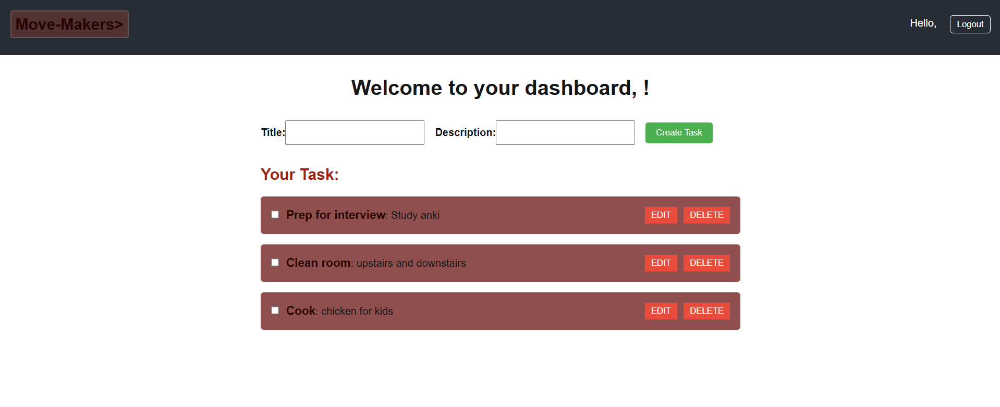

# Move-Makers Task Manager App

A full-stack task management application that allows users to register, log in, and manage personal tasks. Built using the **PERN stack** (PostgreSQL, Express, React/Next.js, and Node.js) with authentication via **JWT**, and styled with custom CSS.

---



## ✨ Features

- 🔐 User registration and login with JWT authentication  
- 📋 Create, read, update, and delete personal tasks (CRUD)  
- ✅ Toggle task completion status  
- ✏️ Edit task details  
- 🔐 Protected routes using context and route guards  
- 📦 Persistent login via localStorage  
- 🖥 Fully responsive UI (Login, Register, and Dashboard)  
- 🎨 Clean layout with separate CSS for forms and dashboard  

---

## 🛠️ Tech Stack

### Frontend
- [Next.js 14 (App Router)](https://nextjs.org/)
- TypeScript
- Axios (with centralized API instance)
- Context API for authentication
- CSS Modules

### Backend
- Node.js + Express
- TypeScript
- Prisma ORM
- PostgreSQL
- JWT for authentication
- CORS and dotenv

---

## 📂 Folder Structure

task-manager-app/
├── client/   # Frontend (Next.js + TypeScript)
└── server/   # Backend (Node.js + Express + Prisma)
Edit


## 🚀 Getting Started

### 🔧 Backend Setup (Express + PostgreSQL + Prisma)

1. Navigate to the server folder:

```bash
cd server
npm install

2. Create a .env file in the server folder:

PORT=5000
DATABASE_URL=your_postgresql_connection_url
JWT_SECRET=your_jwt_secret

3.Run Prisma migrations and generate the client
npx prisma migrate dev --name init
npx prisma generate

4. Start the backend server:

npx ts-node-dev src/server.ts


💻 Frontend Setup (Next.js + TypeScript)
1. Navigate to the client folder:

cd ../client
npm install

2. Start the development server:
npm run dev
http://localhost:3000


🚀 Deployment (Render + Netlify + Railway/NeonDB)
1. Deploy Backend (Render)
Push your code to GitHub (backend and frontend in same repo or monorepo).

Go to Render.com and:

Create a new Web Service.

Connect your GitHub repo.

Set the root directory to /server.

Add environment variables: PORT, JWT_SECRET, DATABASE_URL.

Use build command: npm install && npx prisma generate

Start command: npx ts-node src/server.ts

Free instance is fine.

2. Create a Remote Postgres Database
Use Neon or Railway to create a free PostgreSQL instance.

Copy your connection string and paste it into the DATABASE_URL on Render.

You may also need to allow access from Render’s IP or use connection pooling.

3. Deploy Frontend (Netlify)
Go to Netlify

Create a new project

Point it to the client folder in your repo

Build command: npm run build

Publish directory: out

Add an environment variable:

NEXT_PUBLIC_API_BASE_URL = your Render backend URL (e.g. https://your-backend.onrender.com)

After deployment, test the site

✅ Status
 Backend with JWT auth and full CRUD

 Frontend built with Next.js and protected routes

 Styled forms and dashboard

 Deployed backend and frontend

 Persistent login via localStorage

 Navigation and logout functionality

 Add unit tests (future)

 Add task filtering/sorting (future)

📧 Contact
For questions or suggestions, feel free to reach out or fork this repo and build on it!